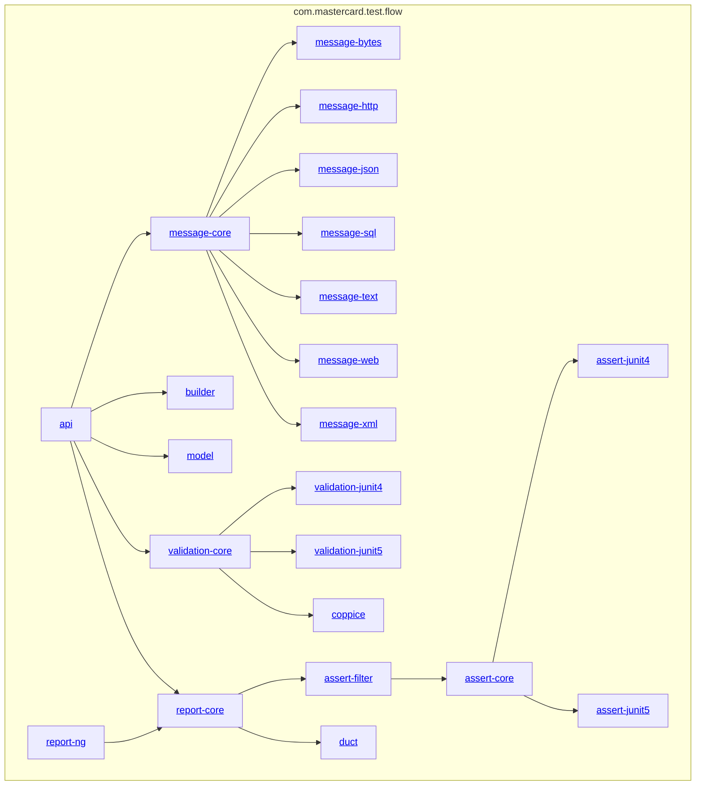

<!-- title start -->

# flow

Testing framework

 * [api](api) Core type declarations
 * [message](message) Implementations of the Message interface
 * [builder](builder) Implementations of the Flow and Interaction interfaces
 * [model](model) Implementations of the Model interface
 * [validation](validation) Checking model consistency
 * [assert](assert) Comparing models against systems
 * [report](report) Visualising assertion results
 * [bom](bom) Bill of materials
 * [aggregator](aggregator) Aggregates build artifacts
 * [example](example) Service constellation to exercise the flow framework
 * [doc](doc) Documentation resources

<!-- title end -->

## Overview

This project provides a framework in which the flow of data in a system can be modelled.
This model can then be used to drive testing, both of the complete system and of subsystems in isolation.
These tests produce a rich execution report, [for example](https://mastercard.github.io/flow/static/app-itest/target/mctf/latest/index.html).

[This document describes the motivations for this approach](doc/src/main/markdown/motivation/index.md).

## Usage

 * [Quickstart guide](doc/src/main/markdown/quickstart.md): Illustrates the construction of a simple system model and its usage.
 * [Further reading](doc/src/main/markdown/further.md): Covers more advanced usage.
 * The submodules under [example](example) illustrate a complete service constellation with flow-based testing

Artifact dependency structure

<!-- start_module_diagram:framework -->

<!-- end_module_diagram -->

## Links

 * This project is copyright © 2022 Mastercard, and is released under the [Apache version 2.0 licence](LICENCE).
 * [Contribution guidance](CONTRIBUTING.md).
 * [Changelog](CHANGELOG.md)
 * [Build artifacts](https://mastercard.github.io/flow/)
