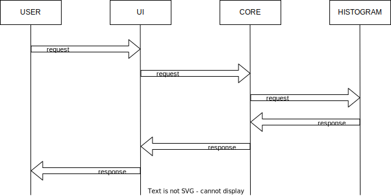
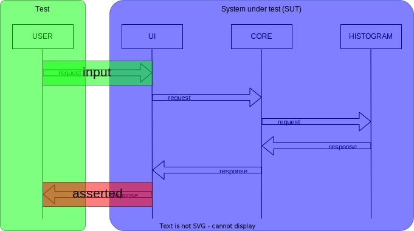
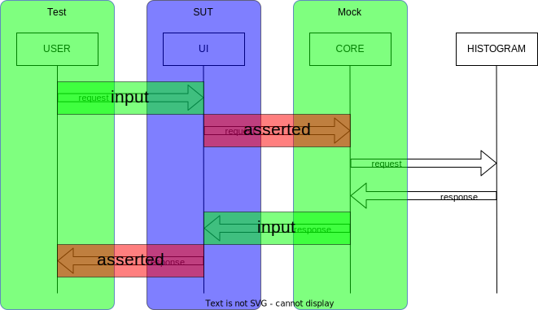
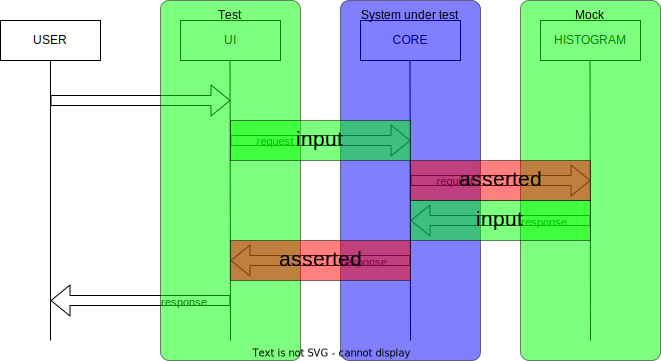
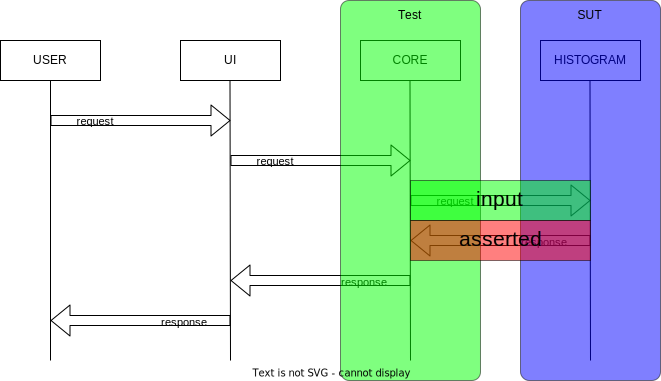

# Example application test coverage

This project contains a set of submodules that implement a simple application, used as a motivating example for the test framework itself.

The test coverage breaks down like so:

## System model

The [`app-model` module](../example/app-model) contains the flow definitions that describe how we believe data moves through the system. For example, the "hello" flow contains the following interactions:

## Integration tests

The application is tested with all component services working together in the [`app-itest` module](../example/app-itest).
The `IntegrationTest` class will start an instance of each of the component services, exercise it with requests from the system model, then assert on the response from the system - checking it against the expected response documented in the system model. For the hello flow, that look like this:

## Unit tests

Each of the component services has a test that exercises it in isolation. Here the test will launch two services:
 * The service under test
 * A mock service that takes the place of the rest of the system

The service under test is provoked with requests taken from the system model. The mock service will capture any requests that the SUT sends to it, and responds with data from the system model.

The "hello" flow is thus exercised in three unit test suites:

