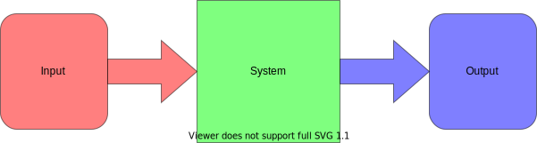
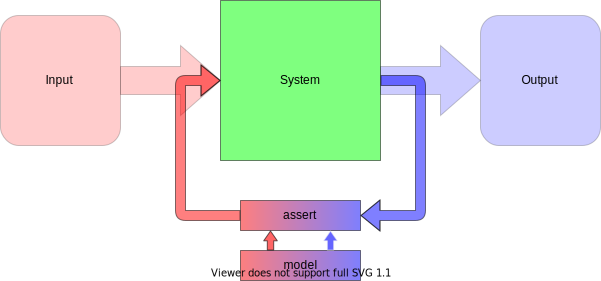
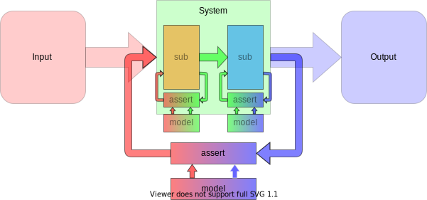

# Motivation

 * [Project root](https://github.com/Mastercard/flow)

This document describes the sequence of lessons that we had to learn before arriving at the approach taken by this project.
Most of these lessons will be crushingly obvious for experienced developers, but software is a world in which it's very easy to get lost in the details of _how_ so it's valuable to revisit the axioms of _why_.

## Software is unpredictable

At the crudest level, all software systems can be characterised as things that accept input, perform some transformation on it, and produce output.



Software systems generally start out life being extremely simple, e.g.:

```
   As a: user
 I want: the computer to greet the world
So that: I feel happy
```

In this state it's possible for a human to fully comprehend the behaviour of the system and to predict what it will do.
Such system are obviously of limited usefulness, so they will be extended to add functionality.

As the system gains new functions and grows in usefulness it becomes more and more difficult for a human to understand what it does.
It will remain possible for humans to understand the system in _general_ terms, but it will be extremely difficult for them to answer detailed questions like
 * What happens if we run it at [midnight of December 31st, 1927 in Shanghai](https://stackoverflow.com/a/6841479/494747)?
 * What happens if the user's name is [literally "Null"](https://www.wired.com/2015/11/null/)?
 * What happens if the user [gets really good at using the interface](https://en.wikipedia.org/wiki/Therac-25)?

The pace at which human predictive ability declines as system complexity rises is shockingly rapid.
This presents a problem: humans are in charge of extending the system to add new functionality, but if we can't understand what it does now then how can we know if our changes will have the desired effect?

---

 * Non-trivial software systems are, by definition, impossible for humans to understand well
 * Successfully changing poorly-understood systems is extremely difficult

## Tests are documentation

We started out with a problem, then created some software to address that problem.
Now we have a _new_ problem - we don't really understand the software so we're too scared to change it in case it breaks.
At this rate it'll never get to [read email](https://matt-rickard.com/zawinskis-law/)!

Undeterred by the outcome of this first software-writing adventure, we write more software to address the new problem: we create a test suite.

The minimum requirement for a test suite is that it defines the desired behaviour of the system and provides a mechanism by which that desired behaviour can be compared against the system's actual behaviour.
If the behaviours do not match, then a human must intervene and decide which is the correct party in the disagreement:
 * If the system is correct then the test suite is updated to describe the system's actual behaviour.
 * If the test suite is correct then the system is updated to conform to the test suite's described behaviour.

Now we have two bits of software both defining the same behaviour:
 * One is the system that will be deployed for use
 * One is the test suite that we use to verify the behaviour of the system

At this point you'll be wondering how, if humans are unable to understand a system's behaviour, defining that same behaviour again and calling it a test suite helps matters: Forcing a human to decide which of two equally-inscrutable behaviours is correct is unlikely to be helpful.

The crucial distinction is that because the test suite is not going to be deployed for actual use, it can implement an _approximation_ of the desired behaviour.
This freedom allows us to implement a simplified version that is more comprehensible for a human.

The typical way in which system behaviour is approximated in test suites is by discretisation - we take a representative range of inputs, work out what the expected outputs should be and encode these in the test suite.
The sample inputs should be carefully chosen to illustrate the system's interesting functionality, edge cases, error conditions, etc.
Comparing the system against the test suite is thus simply a matter of provoking the system with the inputs and checking that the output matches the test suite's expectations.


Now the system can be safely updated: every behaviour change to the system is accompanied by changes to the test suite.
If the impact of the system change is complicated or subtle, then the attendant change to the test suite illustrates that impact to bring it into the grasp of human comprehension.

---
 * Test suites are necessarily an incomplete approximation of system behaviour
 * Tests exist to document system behaviour in a human-readable form

## Test components

Regardless of how a test suite is implemented, it is comprised of two essential components:
 * The _model_ - a description of system behaviour
 * The _assert_ - the mechanism by which the model is compared against the system

The model, being a human-readable description of the system under test, has intrinsic value which scales more-or-less linearly with size.
A richer model with more examples of behaviour is obviously more useful to a human trying to understand the system.

The assert only has situational value: it is required in order to verify the system under test, but apart from that it's just code.
Code is almost always a liability which should be minimised.

Consider a typical simple case in a test suite for the `toUpperCase()` method:

```java
@Test
void upperCase() {
  String input = "foobar";
  String actual = input.toUpperCase();
  String expected = "FOOBAR";
  Assertions.assertEquals( expected, actual );
}
```

Here the model components are the `"foobar"` and `"FOOBAR"` strings, everything surrounding those strings is an assert component.

If we wanted to extend the test suite to cover a different input value, it would be natural to copy and paste the existing test case and update the copy as required.
While this act of copypasta has extended the model, as we intended, it has also doubled the size of the assert component.
If in the future we want to improve the assert components, we'll find we've got twice as much work to do.

The mingling of model and assert also makes it difficult to extract the valuable model data without executing the tests.
That's not really an issue in this example, but when we're testing a system that depends on some scarce or complicated resource then it's useful to be able to look at the model data without having to set up a test environment for the system.

Thus, we should strive to avoid mixing model and assert components together - their only interaction should be the supply of data from the model to the assert:



---
 * Test suites are comprised of model and assert components
 * The model provides value, the assert is (necessary) debt
 * The two should be strictly separated

## Readability

Making software artifacts readable is generally understood to mean making the _input_ side of the software - the source code - easier for humans to read.
The obvious example of such an effort aimed at producing a readable system model is the [Gherkin language](https://cucumber.io/docs/gherkin/reference/).
While this is always a laudable goal, it generally has the unfortunate side effect of limiting the expressive power of the language.
Choosing the language in which to work is a delicate compromise between expressivity (enabling brevity but sacrificing readability) and simplicity (enforcing readability through verbosity), but in general developers will prefer to work in highly-expressive languages.

Happily, the artifact that we're trying to encode (a set of test inputs and expected outputs) is simple enough that we can completely sidestep the question of input language expressivity: Rather than making the source code of the system model readable, we can instead make the _output_ of the test suite readable.
It is a simple matter to update the assert component to produce a human-readable report that details the model data, the captured system behaviour, and the results of comparing the two.
Such a report will provide much better readability than even the clearest source code.

---
 * Readability of test encoding usually limits developer freedom
 * Readability of test outputs is easy to achieve
 * Test outputs should explicitly illustrate system behaviour

## Redundancy

The system model is a collection of test cases - pairs of input and output data.
It will inevitably be the case that some parts of that dataset will be repeated in multiple test cases.

This redundancy will present a problem during system development when the test suite is updated: the effort involved in changing those repeated data portions is multiplied.
While the effort involved in reviewing such changes for correctness is also multiplied, we also introduce a new non-linear risk: human exhaustion.
It is simply not possible for a human to look at page after page of the same change being made to different test cases and maintain adequate focus - the chances of missing something in a review rise sharply as the changeset grows.

---
 * Redundant data in the system model limits development speed and safety
 * Convenience is a contributor to code review efficacy

## Completeness

Data that appears in many separate test cases is in every sense redundant: the very fact of its repetition is an indicator that it is not of interest in a particular testcase.
One tempting way to combat redundancy is thus to simply avoid specifying the repeated portions of the data.
Excluding them from the asserted portions of system output means that less work must be done when the redundant data changes.

This approach introduces the risk of weak testing: it is very easy for developers to only assert on what they _expect_ to happen in a system and ignore the bits of the output that they think are not of interest.
Such tests will fail to expose _unexpected_ changes to behaviour, which is a serious deficiency.

It is much safer to specify a comprehensive model in the test suite and default to comparing it against every aspect of system behaviour.
The conflict between redundancy and completeness should be tackled by other means.

---
 * System model should be comprehensive
 * Tests should default to asserting on the entire output

## Incongruity

At some point the system will grow to a size where it becomes necessary to split it up into subsystems, each responsible for some well-defined area of functionality.
The subsystems can be changed in isolation and are linked together to provide the overall system behaviour.

Having to run the tests for the entire system when making changes to one of the subsystems is a burden on productivity - you spend a lot of time exercising behaviour that has no chance of being affected by your changes.
Accordingly, each subsystem is given a test suite of its own, in addition to the existing suite that exercises them in combination.
This allows developers to quickly iterate on changes to one subsystem using the associated suite, then the integrated system behaviour can be checked once changes are thought to be complete.



Introducing these new test suites has increased the scope for redundancy.
The outputs of one subsystem are the inputs of another, so it is likely that the models in their test suites will contain repeated copies of the same data: used as output assertions in one and input data in another.

Along with redundancy comes the opportunity for subtle differences between copies of repeated content.
Such problems _should_ be caught by the tests that exercise the subsystems together, but history (and [Mars](https://en.wikipedia.org/wiki/Mars_Climate_Orbiter#Cause_of_failure)) is littered with examples of inadequate integration testing.

It would instead be safer to specify a single unified system model that captures system inputs and outputs along with the associated inputs and outputs of subsystems.
This one model can then be used to drive all assertion components.


A unified comprehensive system model driving testing of all subsystems can give confidence that the subsystems will integrate correctly.
This is very valuable in situations where integration testing is inconvenient to run.

---
 * A single unified model should be shared by all assertion components

## Conclusion

The Flow testing framework is the result of these lessons:
 * Model and assert components are strictly separated.
 * Model construction is unconstrained.
 * Data inheritance model to combat redundancy.
 * Review tooling provided for model change management
 * Defaults to whole-message assertion
 * A single model can be used to drive testing of individual subsystems and integrations thereof.
 * Execution report provides excellent visibility of the model contents and system behaviour.

While this framework will not be suitable for every situation, we feel that the lessons that drove its creation are fundamental to software testing.
The most important of these lessons is this: tests are documentation, so they should be optimised for readability.
While it is important that tests are automated, stable, quick and easy to run, and so on, these factors do not capture the _why_ of testing: human comprehension does.

---

 * [Project root](https://github.com/Mastercard/flow)
 * [Example execution report](https://mastercard.github.io/flow/execution/latest/example/app-itest/target/mctf/latest/index.html)
 * [Quickstart guide](../quickstart.md)
 * [Further reading](../further.md)
