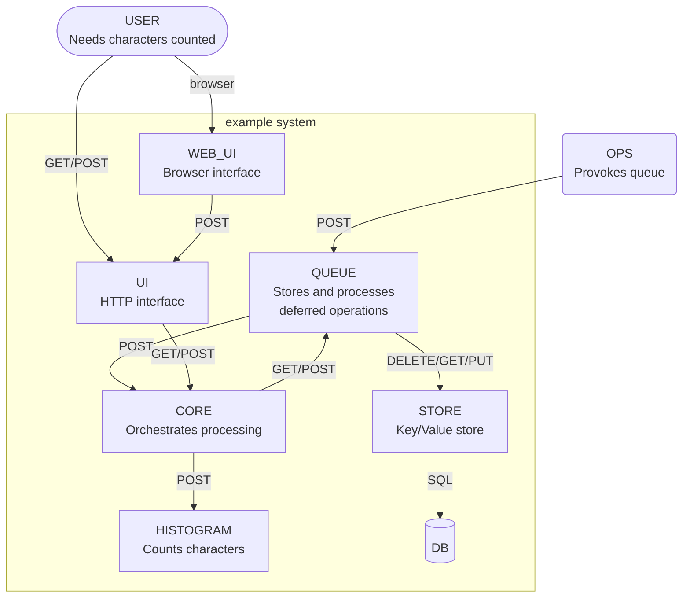
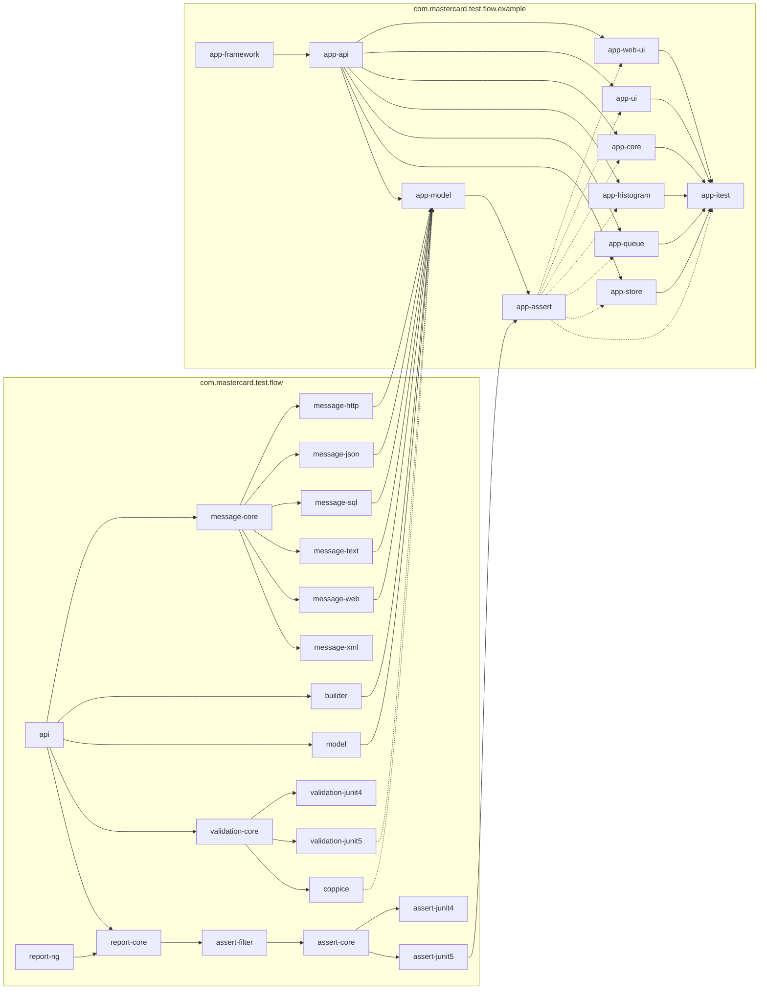

<!-- title start -->

# example

Service constellation to exercise the flow framework
---


 * [../flow](https://github.com/Mastercard/flow) Testing framework
 * [app-framework](app-framework) Library providing a simple microservice framework
 * [app-api](app-api) Library providing interfaces that define the REST API for each service in the example application
 * [app-web-ui](app-web-ui) Front-end service that presents an HTML interface to the system
 * [app-ui](app-ui) Front-end service that accepts external requests
 * [app-core](app-core) Service that orchestrates functionality between services in the example application
 * [app-histogram](app-histogram) Service that counts characters in a given set of text
 * [app-queue](app-queue) Service that handles deferred processing
 * [app-store](app-store) Service that provides data storage
 * [app-model](app-model) Library providing system description flows for creating tests with the Flows framework
 * [app-assert](app-assert) Test library providing shared assertion components
 * [app-itest](app-itest) System integration test suite for exercising app instances

<!-- title end -->

## Example Application Overview

These services present operations that can produce a histogram of specific
characters within a target string. This simple functionality is decomposed
into several services so that the Flow framework can be used to test and illustrate
the data flows between them.

The diagram below illustrates the services and their interdependencies.

<!-- system_diagram_start -->



<!-- system_diagram_end -->


<details>
<summary>Artifact dependency structure</summary>
    Solid lines are <code>compile</code>-scope dependencies, dotted are <code>test</code>-scope.

<!-- start_module_diagram:example -->



<!-- end_module_diagram -->
</details>

## Starting the services

To exercise this application, start each of the individual services.
For example, each service can be started in Maven in a separate terminal.
The commands below are executed from the main "example" directory.

For example:

```shell
mvn exec:java -pl app-core
```

To start the service listening on a specific port, use
the `--port` option during invocation like so:

```shell
mvn exec:java -pl app-ui -Dexec.args="--port 8080"
```

This is particularly helpful with the `app-ui` service so it always
starts on a consistent port.

**Alternatively** all services can be started using the `Main` class
in `app-itest`:

```shell
mvn exec:java -pl app-itest
```

When the cluster is started, this will output a line indicating which
port the UI service is listening on:

```
...
[com.mastercard.test.flow.example.app.itest.Main.main()] INFO com.mastercard.test.flow.example.app.itest.Main - Cluster started with UI on port 60783
```


## Exercising the services

Once the services are up and running, you can send requests to the `app-ui` service.

### Examples

#### A simple histogram

```shell
$ curl -X POST -H "Content-Type: text/plain" --data "the text" http://localhost:8080/histogram
{" ":1,"e":2,"h":1,"t":3,"x":1}
```

#### A deferred histogram

```shell
# submit the data and get back an ID
$ curl -X POST -H "Content-Type: text/plain" --data "the text" http://localhost:8080/histogram/deferred
9e8d6cc8-b66f-48ff-80aa-e51225f1c77b

# query the status of the request
$ curl http://localhost:8080/histogram/deferred/9e8d6cc8-b66f-48ff-80aa-e51225f1c77b
COMPLETE

# Retrieve the results
$ curl -X POST http://localhost:8080/histogram/deferred/9e8d6cc8-b66f-48ff-80aa-e51225f1c77b
{" ":1,"t":3,"e":2,"h":1,"x":1}
```

## Testing the application using Flows

Each service includes its own set of tests based on Flows. Running the tests
will generate flow diagrams in `target/mctf` that show the scenarios under
test and what messaging was asserted.

There is also self-contained functional integration tests in the `app-itest`
module that starts all services and tests the flows.

All of these tests are based on the same 
[set of Flows in the app-model module](app-model).
This demonstrates how a single change to the Model can be used to update service
tests and system integration tests.
