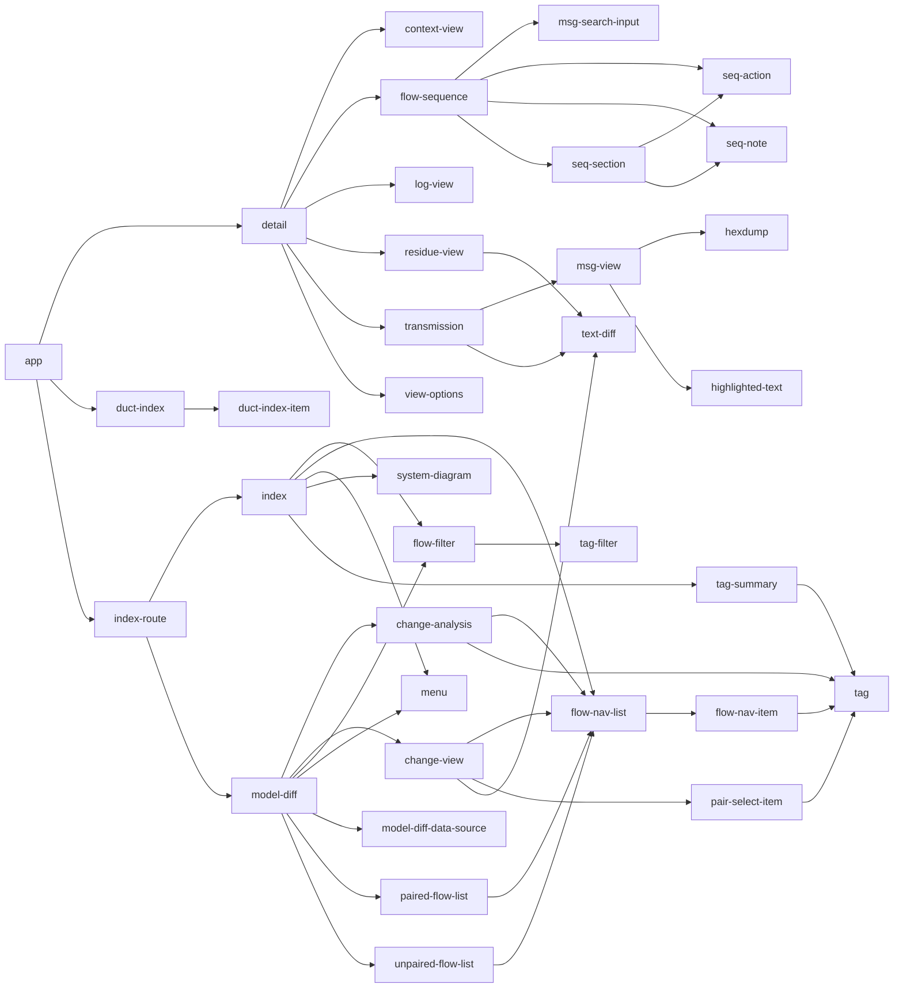

<!-- title start -->

# report-ng

Report webapp

 * [../report](..) Visualising assertion results

<!-- title end -->

## Functionality

This module provides the webapp that renders the report data for human consumption.

## Usage

This module is a dependency of [report-core](../report-core), so it's unlikely you'll need to consume it explicitly.

The published artifact provides resources on the classpath: a directory named `com/mastercard/test/flow/report`.
It can be assumed that this directory contains:
 * a file named `index.html` - This is the container for embedded JSON data
 * a file name `manifest.txt` - This lists the files that make up the webapp. The files named in this file will also appear in the resource directory.

If you want to replace the angular app provided here with some other visualisation behaviour you can exclude this module from your transitive dependencies and replace it with your own set of resources.
As implied above, that resource set should contain:
 * `com/mastercard/test/flow/report/index.html`
 * `com/mastercard/test/flow/report/manifest.txt`

The `index.html` file should contain the strings `// START_JSON_DATA` and `// END_JSON_DATA`.
Everything between these lines will be replaced with the report json data.

The `manifest.txt` file should list the other resource files required for your behaviour.
These are assumed to be available on the classpath with name prefix `com/mastercard/test/flow/report/`.

## Development

### Angular
Run `ng serve --open` for a dev server - `http://localhost:4200/` will be opened in a browser.
The app will automatically reload if you change any of the source files.

By default the `index.html` file contains embedded data that is neither a flow nor an index, so an error message will be shown.
During development, replace that placeholder value with the appropriate JSON structure to exercise the functionality that you want to work on.

Examples of such structures can be found in the `target/report` directory of the [report-core](../report-core) module after a test run.

The unit tests can be run with `ng test`. By default the tests are run in interactive mode.
If you just want to run them all once without seeing them then run `ng test --browsers ChromeHeadless --watch=false`

Angular component structure

<!-- start_component_structure -->

<!-- end_component_structure -->

### Java

The artifacts generated from the angular application are packages in `target/classes`. You might have to explicitly add this directory as a source folder in your IDE build path configuration to avoid failures in downstream projects.

## Build

### Initial

If the `dist/` directory does not contain the compiled webapp artifacts (i.e.: when you first clone the project) then the build will fail and prompt you to set the `node` system property to indicate how you wish to proceed. 
Possible values are:

| value  | effect |
| ------ | ------ |
| system | The pre-existing node installation will be used |
| local  | A node installation will be automatically created in your home directory |
| none   | Compilation of the report app is skipped. Reports will be a basic listing of the embedded JSON data. Tests that exercise the report are skipped |

If you use `-Dnode=system` or `-Dnode=local` to populate the `dist` directory there is no need to continue supplying those system properties for subsequent builds.
If you use `-Dnode=none` you'll have to continue supplying that property in order to avoid the test failures caused by the missing report functionality.

The first build will populate a `node_modules` folder. It will take a long time.

### Subsequent

Running `ng build` will compile the angular app and store the resulting artifacts in the `dist/` directory.
Once the `dist/` directory has been so populated, running `mvn process-resources` (or indeed any [maven phase](https://maven.apache.org/guides/introduction/introduction-to-the-lifecycle.html#lifecycle-reference) that implies `process-resources`, which is all of the interesting ones) will package them up into the output artifact of this module.

These steps can be combined by running either of:
 * `mvn -Pnode-system process-resources` if you have node installed
 * `mvn -Pnode-local process-resources` if you do not have node installed

## Testing

The [report-core](../report-core) module contains a suite of tests that exercise the angular application.
As noted above, these tests will be skipped if system property `node` is set to `none`.

## Acknowledgements

Credit for the sequence diagram on the flow detail pages belongs to [geraintluff/sequence-diagram-html](https://github.com/geraintluff/sequence-diagram-html). A pale shadow of that work has been angularised here.

This project was generated with [Angular CLI](https://github.com/angular/angular-cli) version 12.1.2 and has since been upgraded to 14.1.2.
